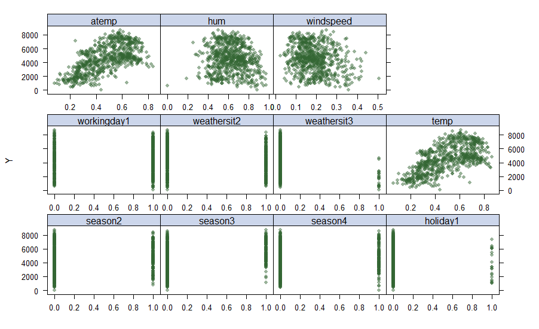

```{r setup, include=FALSE}
knitr::opts_chunk$set(echo = TRUE)
```

# Introduction

## Dataset

The following dataset has been obtained from the UCI Machine Learning Rpository. We are using the dataset that contains daily counts of bike rentals by both registered and casual members from the Capital Bikeshare System during the years 2011 and 2012. This dataset also contains weather data for each that's been extracted from the www.freemeteo.com while it uses the dc.gov page to extract information about the binary holiday column. 

Capital Bikeshare has over 350 stations in Washington, D.C., Alington, VA and MD, etc. 

We are trying to use this dataset to see if temperature, weather and type of day (working day, weekend or a holiday) have any effect on the amount of bike rentals on any given day. Simply put, we're trying to forecast bike rentals on any day. This can have a ton of implications in traffic management. Forecasting the amount of bikes on the road can give a better sense of travel time and allowing taxi services to provide more accurate "estimated time of arrival" estimates. 

## Variables

## Data Cleaning


## Github Site
https://github.com/abhishekajay1718/p8106_mtp_group12

# Exploratory Data Analysis/ Visualization

## Predictors Intercorrelation

## Scatterplots

## splines

# Models

The Predictors we kept to predict the outcome `cnt`--- daily count of rental bikes, are season, holiday, workingday, weathersituation,  temp, atemp, humidity, and windspeed. We choose to delete year and months variable since year does not have any significance in logic, and month variable is highly correlated to season according to the corrplot. In addition, by definition, working day are just days other than holiday and weekday, so we choose to delete weekday to avoid having too many binary variables. We are keeping all the other predictors since none of them appearred to be redundent to us. We will assume that every parameter we kept will have an impact on the outcome variable before modeling. 

we attempt to fit 5 models in total to this dataset which are simple linear regression, GAM, MARS, ridge, lasso.

## Linear Models


## Non-Linear Models
## Tuning Parameters
## Goodness of Fit
## Estimates
# Limitations

# Conclusion