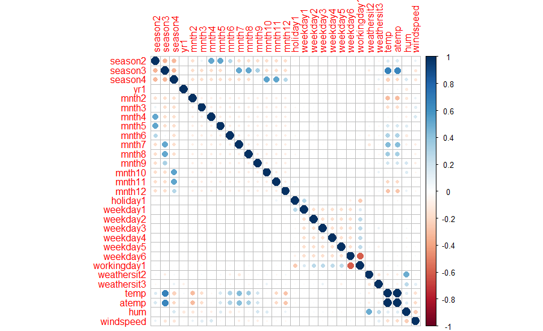
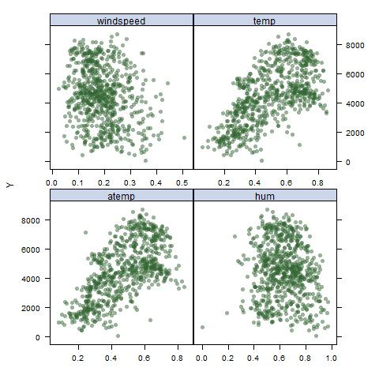
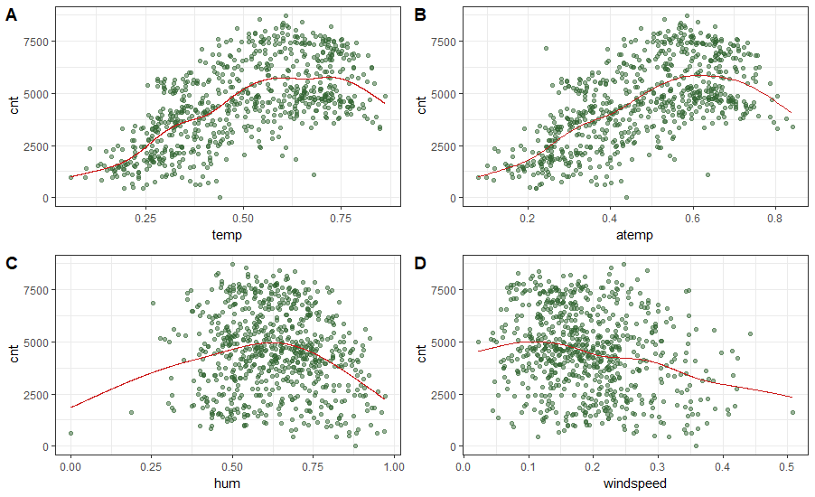

-----------------------------------------------

# Introduction

With the advent of climate change awareness, it has become more important now than ever to look for better alternatives to motorized modes of transportation. One of which is biking. In the recent decades, biking has gained immense popularity in Europe with countries like The Netherlands and Denmark investing heavily in biking infrastructure and making motorized vehicles more expensive. There's one thing that is common to all of these countries. They're all known for the highest quality of life. However, the US is yet to jump on the wagon. 

The bike sharing dataset obtained from the UCI Machine Learning Repository represents bike rental data from the Capital Bikeshare system in Washington, D.C.. We perform the following analysis to forecast the amount of bikes being rented using data from 2011 and 2012 with weather data (obtained and merged into it from freemeteo.com) such as humidity, temperature and the type of day, i.e whether it is a holiday, weekend or weekday. Learning the extent of influence of these predictors in the amount of bikes being rented will give better insights into how bike sharing infrastructure can be developed in urban American cities with what aspects getting higher attention than others to begin with. 

## Data Description
The data set has 731 entries with 16 columns. Every column but "dteday" is continuous numerical in its raw form. dteday is a factor with 731 levels. Our response variable is "cnt", defined as the total count of bikes rented on a given day which is the sum of registered and casual users. temp is *normalized* temperature in Celsius. The values are divided by 41 (max). atemp is *normalized* feeling temperature in Celsius. The values are divided by 50 (max). hum is *normalized* humidity. The values are divided by 100 (max). And, windspeed is *normalized* wind speed. The values are divided by 67 (max). season is 1 for spring, 2 for summer, 3 for fall and 4 forwinter and yr is year 0 for 2011 and 1 for 2012.

## Data Cleaning
From the above data description, we realise and drop dteday and instant since they're not logical predictors for bike rental. Furthermore, we drop registered and casual and just look at their sum-- **cnt** as our response. We tranform the season, month, year (yr), holiday, workingday, weekday, weathersit to factors.

## Github Site
https://github.com/abhishekajay1718/p8106_mtp_group12

-----------------------------------------------

# Exploratory Data Analysis/ Visualization

Here we discuss about the figures attached at the end of the report to showcase what we looked at during our EDA to get a better idea of the data and plan what kind of model will we want to fit to get better predictions. 

## Predictors' Intercorrelation
In the corrplot (fig. 1) we see that `month` variable is highly correlated to `season`, `temp` and `atemp`. Similarly, `workingday` is moderately correlated to `weekday`, however by definition is just a linear combination of holiday and weekday. Therefore, we drop these predictors.

## Scatterplots
We plotted the scatterplot (fig. 2) for all the 8 predictors but only display the 4 that showed some non-linear nature in this report. We see that our continuous variables are the ones that shows non-linear nature, namely-- windspeed, temp, atemp and humidity. We see an increase in bike rentals with temp, however, a decrease in bike rental with humidity and windspeed.

## splines
The splines (fig. 3) actually strengthens our preliminary guesses from the scatterplot regarding a negative association between windspeed, and a increase followed by a steep decrease in bike rental with increasing humidity. 

Temp and atemp both show a general trend of positive association with bike rentals.

-----------------------------------------------
# Models

The Predictors we kept to predict the outcome `cnt`--- daily count of rental bikes, are `season, holiday, workingday, weathersituation,  temp, atemp, humidity, and windspeed`. We choose to delete `year and months` variable since year does not have any significance in logic, and `month` variable is highly correlated to `season` according to the corrplot. In addition, by definition, `working day` are just days other than holiday and weekday, so we choose to delete `weekday` to avoid having too many binary variables. We are keeping all the other predictors since none of them appearred to be redundent to us. We will assume that every parameter we kept will have an impact on the outcome variable before modeling. 

After the above EDA, we attempt to fit 5 models in total to this dataset which are simple linear regression, GAM, MARS, ridge, LASSO with the 8 predictors mentioned above.

## Linear Models
Simple linear regression is the very first attempt we made. we would like to see how well the linear regression model perform and what are the coefficients.  Further non-linear regression will be performed in advance and in comparison to this model. We used lm() function to make the model and the MSE is very high. This is because of the large scale of our response, `cnt` which is on the scale of 1000 compared to our predictors which are around 1.

Since rescaling the outcome variable will change both estimates and the MSE, we chose to both keep the original scale, and run the models the second times while rescaling the outcome by multiplying it to 0.01. 

Futhermore, among those 8 predictors, we decided to perform ridge and LASSO models to shrink the coefficients estimate from linear model. We will select and remove predictors according to their results, and try to produce models with fewer predictors as possible as we can. The resulting estimates are listed in the Estimates section below. 

## Non-Linear Models
According to our splines plot, the four continuous predictors are having non-linear correlation with the outcome. 
We decided to try non-linear model covered in class which are GAM and MARS, and they are expected to be more flexible and have better fit than linear one. 

## Tuning Parameters
To find the best $\lambda$ for ridge and LASSO model, we utilize `cv.glmnet` command to perform cross-validation with a grid ranged from -1 to 10 and its length equals 100. In addition, GCV, generalized cross-validation with K equals to 10 is performed to produce the optimal tuning parameter for GAM model. In order to minimize the prediction error of  MARS model, we choose our tunning grid to have its degree of interaction ranged from 1 to 3, and its number of retained items from 2 to 30. 

## Goodness of Fit
10-Fold Cross-validation is performed to each model and the average test fold MSE is collected to analyze their predictability and their goodness of fit. Each model has been performed twice, one with the original outcome variable `cnt`, one with the outcome rescaled to 0.01. 

The models with rescaled outcome have significant reduction in MSE, while their ranking of goodness of fit does not change. The non-linear models obtained lower MSE than linear models. 

```{r, echo = FALSE, warning=FALSE}
library(knitr)
library(kableExtra)
table1 = matrix(c(1416175,	1418371,1710750,1717490,1718853,141.7557,		141.8371,	169.6783,	170.2468,	175.4663),
                ncol = 2)
colnames(table1) = c("MSE for original outcome"," MSE for scaled outcome")
rownames(table1) = c("MARS", "GAM", "ridge","Linear","LASSO")
knitr::kable(table1, caption = "Average test fold MSE") %>% 
  kableExtra::kable_styling(latex_options = c("striped", "hold_position"))
```

-----------------------------------------------
## Estimates

Estimates of coefficients for each predictor are measured by Simple Linear model, ridge and LASSO model. Each of the three model are performed twice for the original outcome and the rescaled outcome. 

```{r ,echo = FALSE}
table2 = matrix(c(3061.1085  , 917.6644 ,  469.1203 , 1493.7920  ,-596.8185 ,  101.1146  ,-233.9494 ,-1941.7010,5818.3184,406.0477 ,-2610.9173 ,-3280.3364,30.611085,   9.176644 ,  4.691203,  14.937920 , -5.968185,1.011146,  -2.339494 ,-19.417010 , 58.183184,4.060477 ,-26.109173 ,-32.803364 ,2944.1794 ,  840.7957 ,439.4329 , 1383.8011 , -570.4896 ,  103.0900 , -247.3344, -1902.5122 , 3504.1926,2917.0274, -2466.6025,-3087.8805, 29.468977 ,  8.452095 ,  4.426609 , 13.896301 , -5.714296  , 1.030874  ,-2.465057, -19.041578 , 35.311387,28.895797 ,-24.755658, -30.930439, 3050.10123 ,  899.99200 ,  448.73319 , 1479.01403 , -590.47346  ,  98.38661 , -231.47830, -1932.26671,5744.73842  , 517.48958 ,-2602.77634, -3262.74584,28.5482360,   5.1809573  , 0.0000000 , 11.4923601 , -4.3710025 ,  0.2990248 , -1.7623000 ,-17.2240229,58.2129942,  10.3914228, -23.6076260, -29.0829508),ncol = 6)
rownames(table2) = c("(Intercept)","season2"   ,  "season3"  ,   "season4"   ,  "holiday1"   , "workingday1", "weathersit2","weathersit3" ,"temp"    ,    "atemp"    ,   "hum"      ,   "windspeed")
colnames(table2) = c("Linear", "Linear rescaled", "ridge", "ridge rescaled", "LASSO", "LASSO rescaled")
table2 %>% 
  knitr::kable(caption = "Coefficient Estimates") %>% 
  kableExtra::kable_styling(latex_options = c("striped", "hold_position"))
  
```
-----------------------------------------------
## Limitations

We see that there's a large difference in the scale of our response and predictors. This significantly affects our MSE in linear models. For this one might scale their response but that affects our interpretation. 

Our re-scaling is probably a limitation and we believe better methods are out there to better transform it. On the other hand, our non-linear model was flexible enough to campture the underlying truth since our linear models and non linear models both show very high dependence of the reponse on the continuous predictions used in GAM and MARS. This is also noticable with the decrease in our MSE when moving from linear model to non linear models. 

-----------------------------------------------
# Conclusion

Here we'll talk about the scaled outcome to accommodate the fact that our response scale is larger than the predictor scale. From the above MSEs we see that the MARS is the best model to predict the bike rental count, however both the non-linear models have more or less the same MSE (difference = 0.0814). While the worst performing model is LASSO. 

From our EDA, we expected the variables related to the weather to be the most important when planning bike sharing infrastructure to support bike rental counts. Consequently we found the windspeed, humidity, temperature and weather situation to be the most influential predictors, as expected, with the largest coefficients when forecasting bike rental counts. 

Therefore, this analysis tells us that the variables most consequential in estimating bike rentals are mostly weather related. People bike less when there's higher windspeed outside, high humidity outside while they bike more on warmer days. One should keep in mind that our range of temperature is not too high and a warmer day here means mostly a pleasant day. The city planning committee can set up public water dispensers around the city to circumvent to support bike riding even during high humid days, as a suggestion. This study thus will help better plan biking infrastructure in a city.

-----------------------------------------------

```{r pressure, echo=FALSE, fig.cap="Corrplot", out.width = '80%'}

```

```{r , echo=FALSE, fig.cap="Scatterplot", out.width = '80%'}

```

```{r , echo=FALSE, fig.cap="Splines", out.width = '80%'}

```